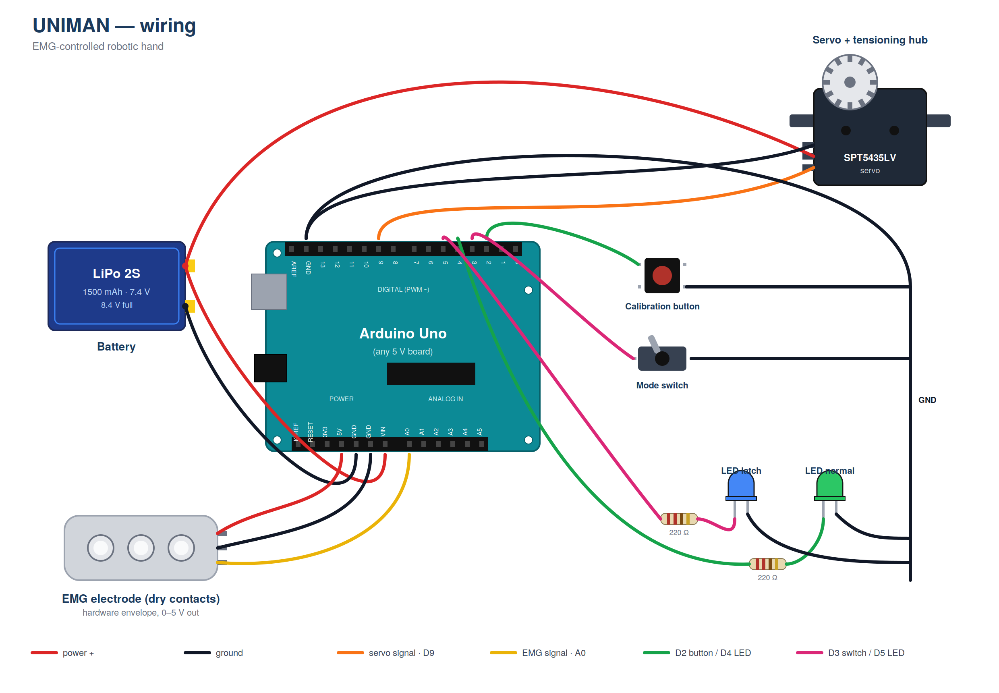

# Electronics

Wiring diagram for UNIMAN.

Pin assignment:

| Pin | Function |
|---|---|
| A0 | EMG envelope input |
| D2 | Calibration button (momentary, to GND) |
| D3 | Mode switch (bistable, to GND) |
| D4 | LED — normal mode |
| D5 | LED — latch mode |
| D9 | Servo signal |

The servo is powered directly from the 2S LiPo. The EMG electrode and
LEDs are powered from the Nano's 5 V rail.
